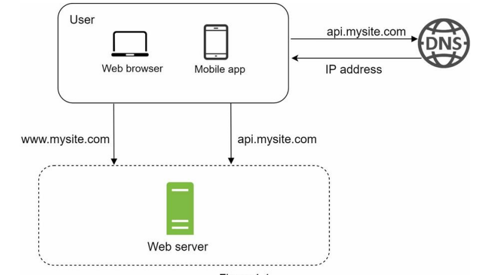
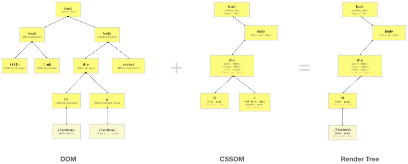

# Browser Processing and Rendering
## Workflow

Step 1: Navigation and DNS Look Up

When are user enters the URL in the browser, the browser performs DNS Lookup to retrieve the IP address of the server which is then cached for a period of time to improve performance by avoiding lookups.

Step 2: HTTPS Exchange and Handshake 

After getting the IP info, the browser performs a three-way TCP handshake which helps to setup the parameters of TCP socket to enable HTTP Exchange between client and server. Thereafter it also helps in negotiating a TLS handshake for encrypted communication. All of these can lead to a lot of round trips but is necessary due to security reasons.

Step 3: Response Retrieval

Once the connection is setup, the browsers perform a HTTP GET request to retrieve the HTML data and other headers. The first byte of data(chunk) received is usually 14KB and then using an algorithm to increase the size of the next incoming chunk doubles and so on until the bandwidth is maximized.

Step 4: Parsing

Once the data packets are received its starts parsing them into the DOM and CSSOM structure which is then rendered to paint a page on the screen. CSSOM stands for CSS Object Model which is a Tree Like structure just like DOM. The DOM and CSSOM tree are developed from the respective files buy performing the parsing as shown below. 

While the CSS is being parsed and the CSSOM created, other assets, including JavaScript files, are downloading (thanks to the preload scanner). JavaScript is interpreted, compiled, parsed, and executed. The scripts are parsed into abstract syntax trees. It is important to note that when the script tag is encountered the DOM construction is pause (this can be solved with the async attribute) and that’s why the location of the script matters to give proper access to DOM elements. Further the JavaScript execution will be halted until the CSSOM is ready.

Step 5: Rendering (The Critical Rendering path)

The Rendering Process includes steps like Style, Layout, Paint and in some cases Composting. The layout is developed from the Render Tree for every visible element and then painted on the screen. Content is some cases is promoted to their own layers to improve performance using GPU.

- Layout is the process by which the width, height, and location of all the nodes in the render tree are determined, plus the determination of the size and position of each object on the page. Reflow is any subsequent size and position determination of any part of the page or the entire document.
- Painting involves drawing every visual part of an element to the screen, including text, colors, borders, shadows, and replaced elements like buttons and images. 
- When sections of the document are drawn in different layers, these layers are sent to GPU to finally draw it on the screen by performing Composting Operations

